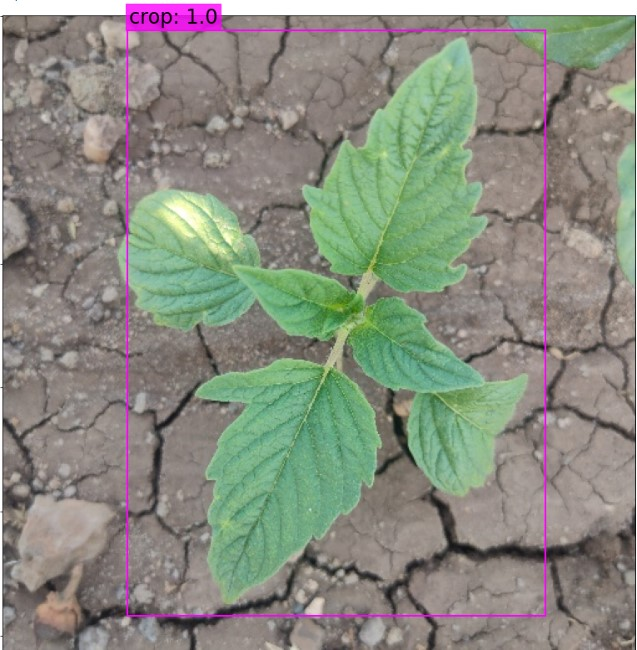
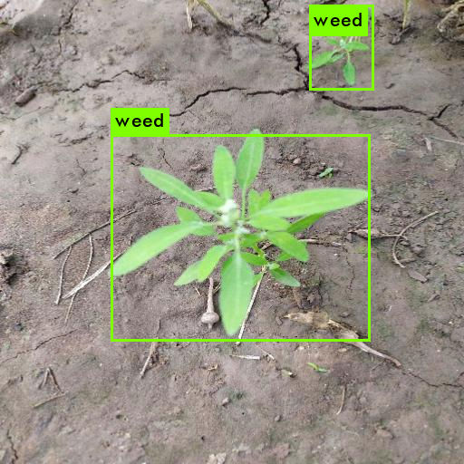

# 🌱 Smart Agriculture: Weed Detection & Plant Species Identification


---

## 📌 About the Project

Weeds pose a significant challenge in precision agriculture, competing with crops for water, sunlight, and nutrients, thereby reducing total crop yields. 

This project delivers a **dual-engine computer vision & AI system** for intelligent agricultural management:
1. **YOLOv3 Object Detection**: Locates and draws bounding boxes around `crop` and `weed` instances in field images.
2. **Pl@ntNet Botanical AI API Integration**: Identifies exact plant species, common names, family, genus, and confidence scores from uploaded plant photos.

It features an interactive **Streamlit Web Application** allowing farmers, researchers, and agronomists to upload field images and perform instant, accurate analysis.

---

## 📸 Sample Outputs & Demonstrations

### 🎯 1. YOLOv3 Crop & Weed Detection Outputs
Below are sample detection results showing bounding boxes around detected crops and weeds:

| Detection Output 1 | Detection Output 2 |
| :---: | :---: |
|  |  |

---

### 🔬 2. Pl@ntNet API Species Identification Output

When an image is passed to the **Pl@ntNet Botanical AI engine**, the application provides rich taxonomic information:

```text
============================================================
🔬 Pl@ntNet Botanical Analysis Result
============================================================
🏆 Best Match       : Solanum melongena L.
📊 Confidence Score : 94.8%
🌿 Organ Analyzed   : Leaf

📋 Taxonomic Classification:
 ├── Scientific Name : Solanum melongena
 ├── Family          : Solanaceae
 ├── Genus           : Solanum
 └── Common Names    : Eggplant, Aubergine, Brinjal
============================================================
```

---

## ✨ Key Features

- 🎯 **Localized Object Detection**: YOLOv3 model trained specifically to differentiate between crops and weeds.
- 🔬 **Botanical Species Identification**: Powered by the **Pl@ntNet API v2** for real-time botanical classification.
- 🚀 **Combined AI Analysis Mode**: Dual-pane layout running YOLO bounding-box detection alongside Pl@ntNet botanical species identification.
- 🌿 **Organ Type Customization**: Filter plant identification by organ type: `leaf`, `flower`, `fruit`, `bark`, or `auto`.
- 🎛️ **Interactive Controls**: Adjust IOU and NMS detection confidence thresholds dynamically in the web UI.

---

## 📁 Project Structure

```text
weed-detection/
├── Crop_weed_detection_training/       # Darknet YOLOv3 training pipeline & notebooks
│   ├── crop_weed.cfg                  # YOLOv3 network architecture configuration
│   ├── crop_weed_detection.ipynb      # Google Colab notebook for GPU training
│   ├── generate_train.py              # Training script generator
│   ├── obj.data                       # Dataset metadata specification
│   ├── obj.names                      # Class definitions (crop, weed)
│   └── test/                          # Sample test images
├── performing_detection/               # Inference engine & Streamlit app
│   ├── data/                          # Configuration & dataset assets
│   │   ├── cfg/                       # Model configuration files
│   │   ├── detection/                 # Visual output detection samples
│   │   ├── names/                     # Class names file
│   │   └── weights/                   # Pre-trained YOLO model weights
│   ├── opencv/                        # OpenCV detection notebook
│   └── pytorch/                       # PyTorch Darknet engine & Streamlit App
│       ├── app.py                     # Tabbed Streamlit web application
│       ├── darknet.py                 # PyTorch Darknet model implementation
│       ├── detection.py               # Main Streamlit web application
│       ├── plantnet_api.py            # Pl@ntNet API integration service
│       └── utils.py                   # Bounding box & NMS processing helper functions
├── .gitignore                         # Excluded binaries and temporary files
├── README.md                          # Project documentation
└── requirements.txt                   # Required Python libraries & dependencies
```

---

## ⚙️ Installation & Setup

### 1. Clone the Repository
```bash
git clone https://github.com/Jaswanth2108/weed-detection.git
cd weed-detection
```

### 2. Install Dependencies
Ensure you have Python 3.9+ installed, then run:
```bash
pip install -r requirements.txt
```

### 3. Model Weights Setup
Download or place your pre-trained `crop_weed_detection.weights` file into:
```text
performing_detection/data/weights/crop_weed_detection.weights
```

---

## 🚀 Running the Web Application

Launch the Streamlit dashboard using Python:

```bash
streamlit run performing_detection/pytorch/detection.py
```
Or run the alternative tabbed interface:
```bash
streamlit run performing_detection/pytorch/app.py
```

Open your browser and navigate to `http://localhost:8501`.

---

## 🔑 Pl@ntNet API Configuration

The application is pre-configured with Pl@ntNet API support. You can also supply your own API key directly inside the Streamlit sidebar or update `PLANTNET_API_KEY` in `performing_detection/pytorch/plantnet_api.py`.

```python
PLANTNET_API_KEY = "your_plantnet_api_key_here"
```

To request your free API key, visit [Pl@ntNet API Developer Portal](https://my-api.plantnet.org/).

---

## 🛠️ Technology Stack

- **Frontend / UI**: Streamlit
- **Object Detection**: Darknet / PyTorch YOLOv3
- **Plant Species Classification**: Pl@ntNet API v2
- **Image Processing**: OpenCV, PIL, NumPy, Matplotlib

---

## 📄 License

This project is licensed under the MIT License - feel free to use and adapt for your agricultural AI projects!